# react-native-svg-charts-examples

This repository is meant to serve as a showcase for [`react-native-svg-charts`](https://github.com/JesperLekland/react-native-svg-charts).
Here we try to gather all the coolest implementations and use cases to serve as inspiration for other people. Open Source is all about sharing knowledge!

Have you ever made a cool graph using `react-native-svg-charts`, maybe a super complex use case or just really pretty design?
Make a PR with your code and include it here for everyone to see.

Have a separate repo with some awesome examples? Make a PR and just include the link to your repo in this README, We'd rather have too many cool examples!

Just make sure that all examples are fully reproducible demos so that people don't have to figure a bunch of stuff out on the own.

Click an example to see the code! 💪

# Examples

* [AreaChart](#areachart)
* [StackedAreaChart](#stackedareachart)
* [Bar](#bar)
* [Line](#linechart)
* [ProgressCircle](#progresscircle)
* [PieChart](#piechart)

## AreaChart

[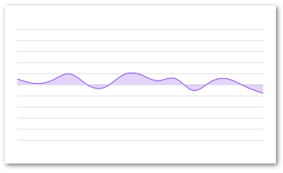](./storybook/stories/grid-min-max.js)

[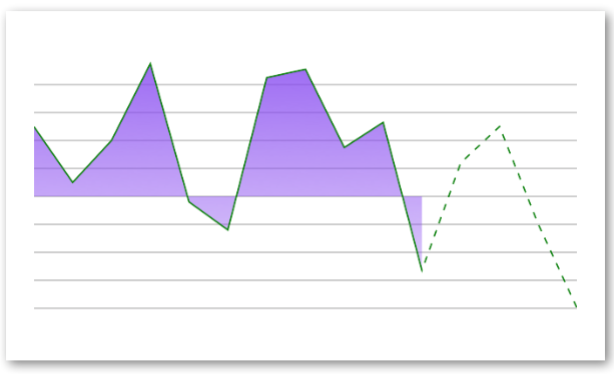](./storybook/stories/partial-chart/area-chart.js)

[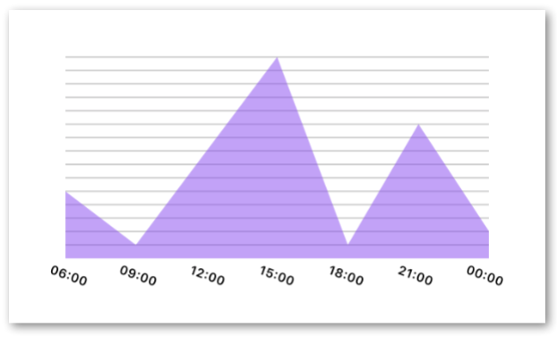](./storybook/stories/x-axis/scale-time.js)

## BarChart

[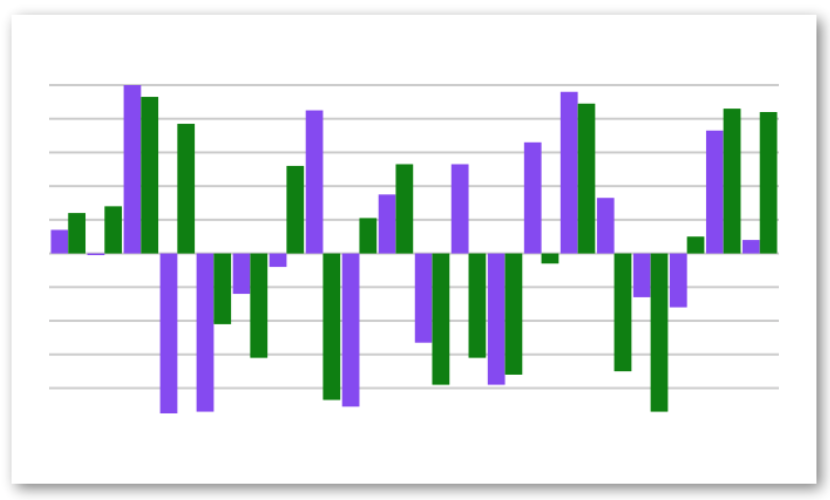](./storybook/stories/bar-chart/with-multiple-data-sets.js)
[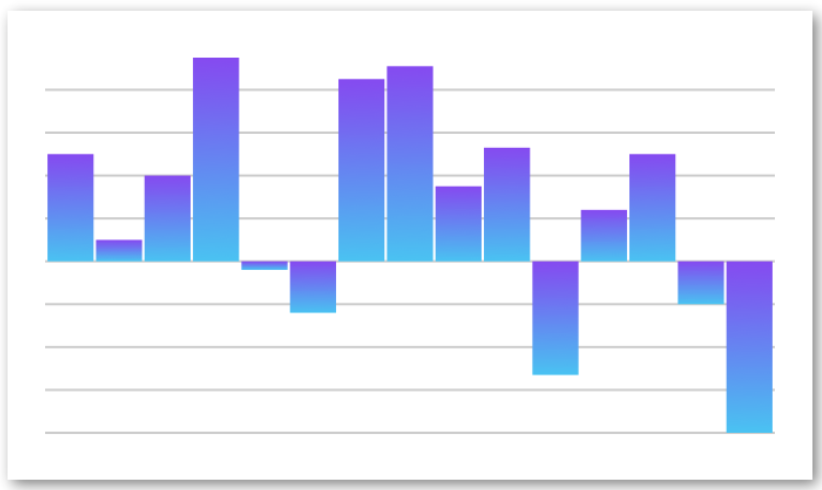](./storybook/stories/bar-chart/with-gradient.js)

[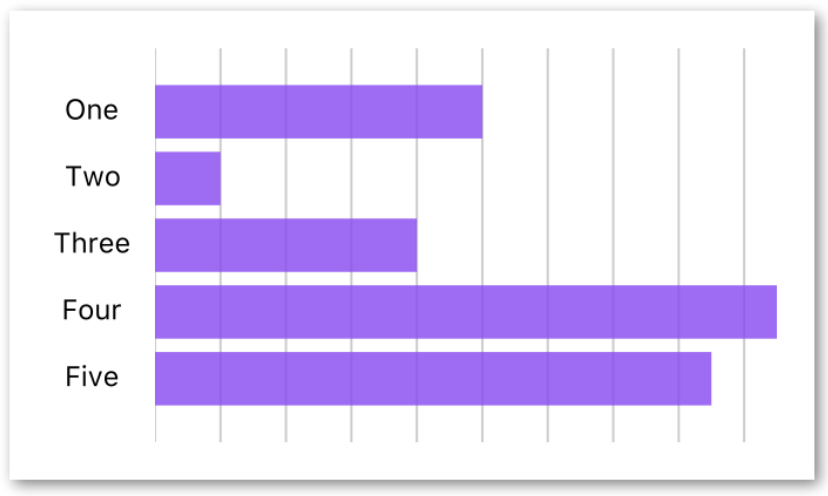](./storybook/stories/bar-chart/horizontal-with-axis.js)
[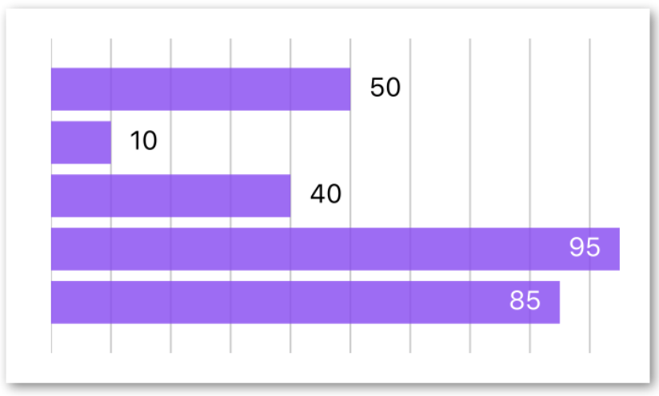](./storybook/stories/bar-chart/horizontal-with-labels.js)
[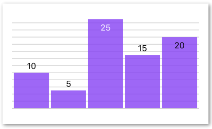](./storybook/stories/bar-chart/vertical-with-labels.js)
[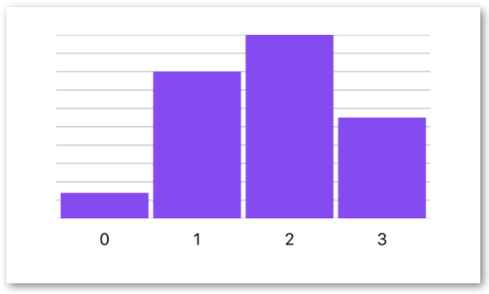](./storybook/stories/x-axis/scale-band.js)

## LineChart

[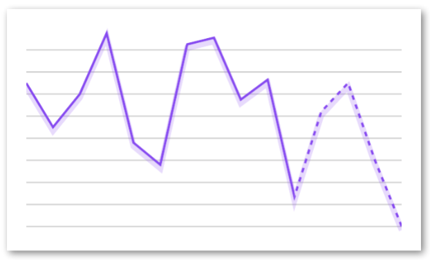](./storybook/stories/partial-chart/line-chart.js)

[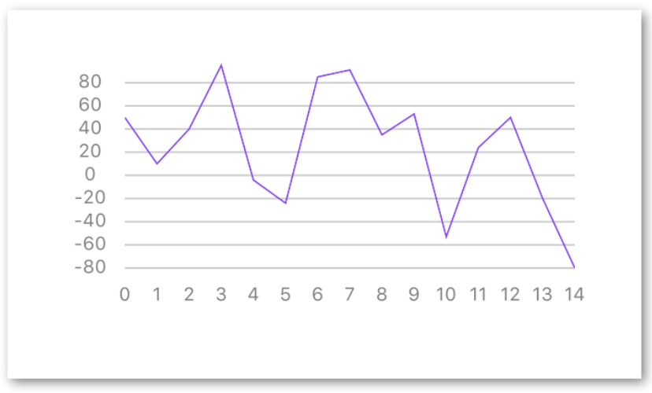](./storybook/stories/both-axes.js)
[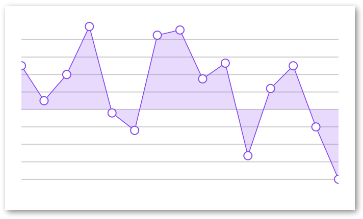](./storybook/stories/decorator.js)

## StackedAreaChart

[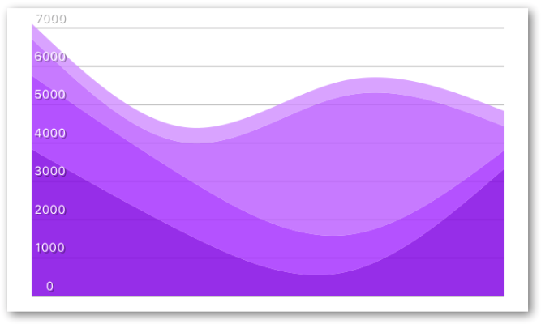](./storybook/stories/area-stack/with-y-axis.js)

## ProgressCircle

## PieChart

[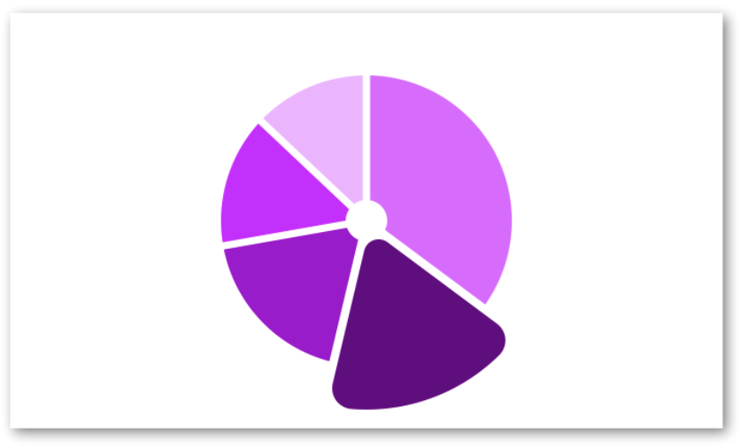](./storybook/stories/pie-chart/with-different-arcs.js)
[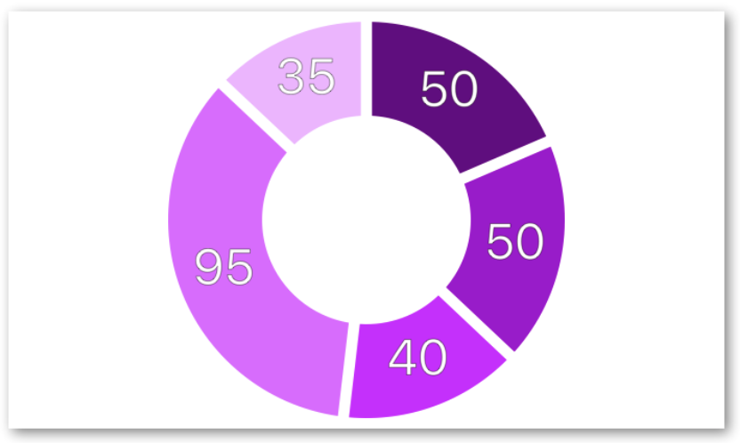](./storybook/stories/pie-chart/with-centered-labels.js)
[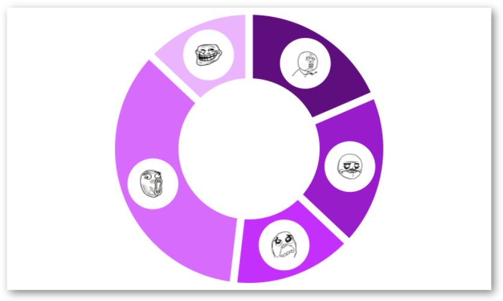](./storybook/stories/pie-chart/with-image-labels.js)

## License
[MIT](./LICENSE)
